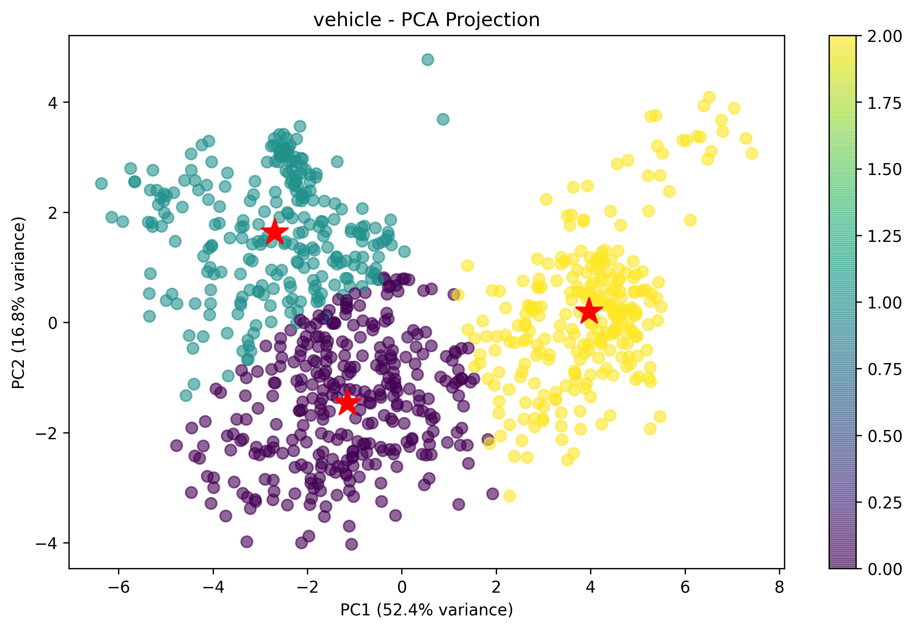

## Machine learning Project- K-means 

- Lecture: Dr. Mohammed Khalilia
- Ruwa F. AbuHweidi 

### [Project structure:]()

<pre><code>
.
├── .venv/
├── data/
│   ├── 3gaussians_std0.6.csv
│   ├── 3gaussians_std0.9.csv
│   ├── circles.csv
│   ├── iris.csv
│   └── moons.csv
│   ├── digits.csv
│   ├── complex9.csv
│   └── vehicle.csv
├── dbscan_results/
├── kmean-results/
├── logs/
│   └── clustering_results-3.8.log
├── spherical-results/
├── src/
│   ├── utils/
│   │   ├── __init__.py
│   │   ├── dbscan.py
│   │   ├── download_datasets.py
│   │   ├── k_mean.py
│   │   ├── logger.py
│   │   ├── spherical_rfa.py
│   │   └── visualization.py
│   ├── __init__.py
├── main.py
├── README.md
├── requirement3.8.txt
└── requirement3.12.txt
</code></pre>

---
### ▶️ How to run the code:
In cli:

'''
- git clone https://github.com/RuwaYafa/ClusteringProject-3.8.git
- conda create -n k-means python=3.8 
- conda activate k-means
- pip install -r requirements3.8.txt
- python main.py
  
'''

---
### ▶️ Step 1: Understand the Project Requirements
> Main Task: Implement k-means clustering from scratch in Python
>│   │   ├── k_mean.py

- Base code: https://scikit-learn.org/stable/auto_examples/cluster/plot_cluster_comparison.html

>Additional Tasks:
Compare with DBSCAN and Spherical Clustering (using existing implementations)
Apply to the provided datasets
>│   │   ├── spherical_rfa.py
- Base code inspired by: https://github.com/jasonlaska/spherecluster

>package:
- https://pypi.org/project/spherecluster/0.1.7/#spherecluster-0.1.7-py3-none-any.whl

>│   │   ├── dbscan.py
- Base code: https://stackoverflow.com/questions/61233304/clustering-with-dbscan-how-to-train-a-model-if-you-dont-set-the-number-of-clust
Visualize results (including dimensionality reduction for high-dimensional data)
Write a comprehensive report in LaTeX

>│   │   └── visualization.py

---
### ▶️ Step 2: Set Up Development Environment
Install required Python packages: 
- All clustering algorithms work on Python 3.8
- All clustering algorithms work on Python 3.12, except spherical clustering
      
---
### ▶️ Step 3: Implement k-Means from Scratch:

>[!Pseudocode for k-Means]

[1] Initialize k centroids randomly from the data points

[2] Repeat until convergence:
   - Assign each point to the nearest centroid (Euclidean distance)
   - Update centroids as the mean of assigned points
   - Check if centroids changed significantly

---
### ▶️ Python Implementation Steps:

>The project was implemented in Python 3.12.
You can run k-means and DBSCA, except for Spherical clustering.
It is implemented in Python 3.8, with a slight change in the spherical library 
https://github.com/jasonlaska/spherecluster.git
https://pypi.org/project/spherecluster/0.1.7/#spherecluster-0.1.7-py3-none-any.whl

- If you run the code in just comment out the Call to spherical_rfa at the end of the main.py file

---
### ▶️ Hints to run spherical_rfa.py:

>python --version
>>Python 3.8.10 
https://www.youtube.com/watch?v=AUiM1UaRCPc  
https://www.python.org/downloads/release/python-3810/

>pip install spherecluster==0.1.7  
>>https://pypi.org/project/spherecluster/0.1.2/#description

>pip debug --verbose

>pip install requests

- from -> https://www.cgohlke.com/
- pip install setuptools-50.0.0-py3-none-any.whl  # https://pypi.org/project/setuptools/50.0.0/
- pip install setuptools==50.0.0
- pip install pip-20.2.4-py2.py3-none-any.whl > in download  # https://www.piwheels.org/project/pip/
- pip install scikit-learn==0.22  # https://pypi.org/project/scikit-learn/0.22/#history
- pip install requests

---
[!Tip] pip freeze to collect the requirements:
- pip install -r requirement3.8.txt
- pip install -r requirement3.12.txt

---
##### 🙏 Acknowledgments
We thank Professor [Mohammed Khalilia](https://github.com/mohammedkhalilia) for his expert guidance and open educational contributions on GitHub.

We also appreciate the help of large language models (LLMs), which offered respectful and minimal guidance when asked without altering the author's custom implementations.

—
Ruwa Yafa @ 2025
